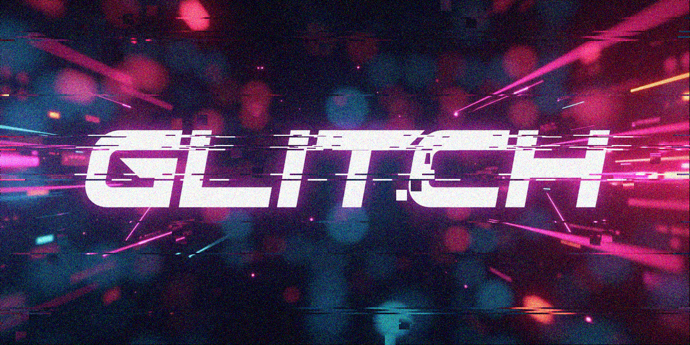

# Image Glitcher



## Table of Contents

- [Image Glitcher](#image-glitcher)
  - [Table of Contents](#table-of-contents)
  - [Introduction](#introduction)
  - [Features](#features)
  - [Project Structure](#project-structure)
  - [Installation](#installation)
  - [Configuration](#configuration)
    - [Configuration Parameters](#configuration-parameters)
  - [Usage](#usage)
  - [Adding New Effects](#adding-new-effects)
  - [Dependencies](#dependencies)
  - [License](#license)

## Introduction

This script is designed to quickly apply various glitch effects to images. This is a Python-based tool I've put together for fun (it might still have some bugs or unintended behaviour). New modules can be added without changing the core script, as simple scripts added to the effects folder. I might add more effects in the future; the available ones are listed below.

## Features

- **Modular Effects:** Each effect is encapsulated in its own module.
- **Configurable Parameters:** You can customize the intensity and behavior of each effect through a JSON configuration file.
- **Random Seed Support:** To ensure reproducibility, you can set a random seed for the glitch effects.
- **Batch Processing:** Apply glitch effects to multiple images in a specified input folder.
- **Easy Extensibility:** Add new glitch effects by simply creating new modules.

## Project Structure

```
ImageGlitcher/
│
├── effects/
│   ├── __init__.py
│   ├── gaussian.py
│   ├── salt_pepper.py
│   ├── block.py
│   ├── shift.py
│   ├── distortion.py
│   └── rgb_shift.py
│
├── input/
│   └── (your input images)
│
├── output/
│   └── (processed images will be saved here)
│
├── config.json
├── glitch.py
├── requirements.txt
└── README.md
```

- **effects/**: Contains individual glitch effect modules.
- **input/**: Directory where you place images to be processed.
- **output/**: Directory where processed images will be saved.
- **config.json**: Configuration file defining input/output folders and effect parameters.
- **glitch.py**: Main script to apply glitch effects.
- **requirements.txt**: Lists Python dependencies.
- **README.md**: This documentation file. :)

## Installation

1. **Clone the Repository**

   ```bash
   git clone https://github.com/zeerats/glitch.git
   cd glitch
   ```

2. **Set Up a Virtual Environment (Optional but Recommended)**

   ```bash
   python -m venv venv
   source venv/bin/activate  # On Windows: venv\Scripts\activate
   ```

3. **Install Dependencies**

   ```bash
   pip install -r requirements.txt
   ```

## Configuration

Customize the glitch effects and processing parameters by editing the `config.json` file. Below is an example configuration:

```json
{
    "input_folder": "input",
    "output_folder": "output",
    "effects_order": [
        "gaussian",
        "salt_pepper",
        "block",
        "shift",
        "rgb_shift"
    ],
    "effects": {
        "gaussian": {
            "mean": 0.0,
            "std": 25.0,
            "rgb": true
        },
        "salt_pepper": {
            "amount": 0.02,
            "salt_vs_pepper": 0.5,
            "rgb": true
        },
        "shift": {
            "shift_range": [
                -30,
                30
            ],
            "num_lines": 20,
            "shift_line_height": 3,
            "rgb": false
        },
        "block": {
            "block_size": 50,
            "displacement": 50,
            "num_blocks": 100,
            "rgb": true
        },
        "distortion": {
            "distortion_strength": 0.5
        },
        "rgb_shift": {
            "distortion_strength": 100,
            "num_bands": 10
        }
    },
    "seed": 42
}
```

### Configuration Parameters

- **input_folder**: Directory containing images to be processed.
- **output_folder**: Directory where processed images will be saved.
- **effects_order**: List defining the order in which effects are applied.
- **effects**: Dictionary containing parameters for each effect.
  - **gaussian**
    - `mean`: Mean value for Gaussian noise.
    - `std`: Standard deviation for Gaussian noise.
    - `rgb`: Apply effect per RGB channel if `true`.
  - **salt_pepper**
    - `amount`: Proportion of image pixels to alter.
    - `salt_vs_pepper`: Ratio of salt to pepper noise.
    - `rgb`: Apply effect per RGB channel if `true`.
  - **shift**
    - `shift_range`: Tuple defining the range of pixel shifts.
    - `num_lines`: Number of lines to shift.
    - `shift_line_height`: Height of each shifted line.
    - `rgb`: Apply effect per RGB channel if `true`.
  - **block**
    - `block_size`: Size of blocks to displace.
    - `displacement`: Maximum displacement for blocks.
    - `num_blocks`: Number of blocks to displace.
    - `rgb`: Apply effect per RGB channel if `true`.
  - **distortion**
    - `distortion_strength`: Strength of lens distortion.
  - **rgb_shift**
    - `distortion_strength`: Strength of RGB channel shifting.
    - `num_bands`: Number of bands for RGB shifting.
- **seed**: (Optional) Integer value to set the random seed for reproducibility.

## Usage

1. **Prepare Input Images**

   Place the images you want to glitch in the `input/` directory. Supported formats include `.png`, `.jpg`, `.jpeg`, `.bmp`, `.tiff`, and `.gif`. NOTE: I haven't tested all of them, so some might not work. Also, files with the same name in the output folder will be overwritten.

2. **Run the Glitch Script**

   Execute the main script to apply the glitch effects:

   ```bash
   python glitch.py
   ```

3. **View Processed Images**

   After processing, the glitched images will be available in the `output/` directory.

## Adding New Effects

One of the key advantages of the modular architecture is the ease of adding new glitch effects. Follow these steps to introduce a new effect:

1. **Create a New Effect Module**

   Navigate to the `effects/` directory and create a new Python file for your effect, e.g., `new_effect.py`.

   ```bash
   cd effects
   touch new_effect.py
   ```

2. **Implement the `apply` Function**

   Define an `apply(image, params)` function following the standard interface. Here's an example for an invert color effect:

   ```python
   import numpy as np

   def apply(image, params):
       invert = params.get('invert', True)
       if invert:
           return 255 - image
       return image
   ```

3. **Update `config.json`**

   Add the new effect to the `effects_order` list and specify its parameters.

   ```json
   "effects_order": [
       "gaussian",
       "salt_pepper",
       "block",
       "shift",
       "rgb_shift",
       "new_effect"
   ],
   "effects": {
       ...
       "new_effect": {
           "invert": true
       }
   }
   ```

4. **No Changes Needed in `glitch.py`**

   The main script will automatically detect and load the new effect.

## Dependencies

Ensure that all necessary dependencies are listed in your `requirements.txt`:

```
Pillow
numpy
```

Install them using:

```bash
pip install -r requirements.txt
```

## License

This project is licensed under the [MIT License](LICENSE).